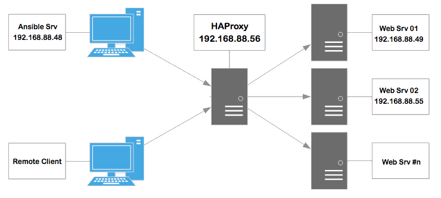

# tk-projectx
Test assignment project

The purpose of thsi project is using Ansible deploy and/or re-deploy  multiple web instance(s) without effecting end-user experiance providing high availability.

Assume that we use already deployed EC2/VM or Bare-Metal base os insatlled CentOS 7.5 and reach via SSH connections.

Documantion TBD...
